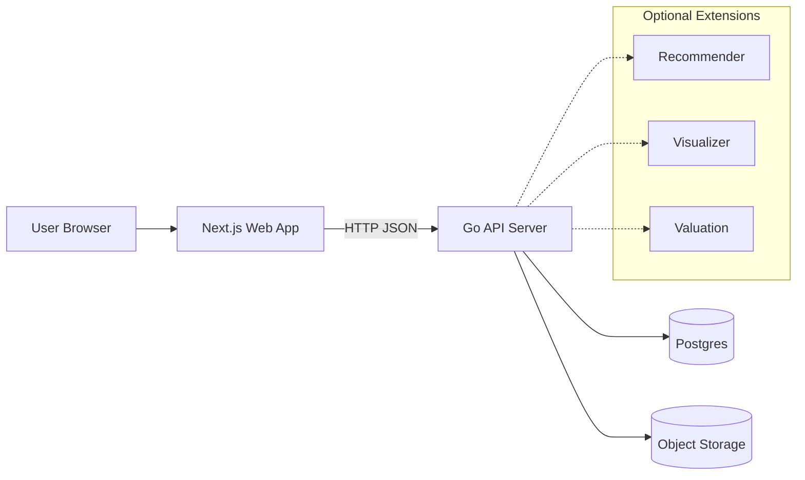

# Architecture

This document describes the **initial system architecture** for Artium (auction-first).  
It focuses on the **core auction platform** (auth, listings, pictures, bids).  
Support features such as recommender/visualizer/valuation are treated as **extension points** and are not specified in detail yet.

---

## Goals
- Provide a simple **art auction** experience:
  - sign up / login
  - browse listings (home)
  - create listings (seller)
  - view listing details (buyer)
  - place bids and see bid history
- Keep the system **hackathon-friendly**: easy to run locally, minimal moving parts.

## Non-goals
- Payment processing / escrow
- Full anti-fraud / KYC
- High-frequency real-time bidding
- Multi-region availability

---

## High-Level Diagram

**Core components**
- **Next.js Web App (`apps/frontend`)**: UI, form validation, calls backend APIs.
- **Go API Server (`apps/backend`)**: authentication, listings, bidding logic, upload orchestration.
- **Postgres**: source of truth for users/items/pictures/bids.
- **Object Storage**: stores uploaded images; DB stores references (URLs/keys).

---

## Frontend Pages (MVP)

### 1) Auth
- `/signup`
- `/login`

### 2) Home / Browse
- `/` (browse items; default pagination; max 100 per request)

### 3) Post Item (Seller)
- `/items/new` (create an auction listing + attach images)

### 4) Item Page (Buyer)
- `/items/[itemId]`
  - item details
  - images carousel
  - bid box + bid history
  - (later) recommender / visualizer / valuation widgets

---

## Backend (Go API) Responsibilities

### Auth
- Create users and store `password_hash` (never plaintext).
- Issue JWT for authenticated requests.
- Protect seller/bid endpoints.

### Items (Listings)
- Create listing, validate auction times.
- Enforce listing status transitions:
  - `draft → active → ended` (and optionally `cancelled`)
- Serve listing summaries and full details.

### Pictures
- Accept temporary uploads (or generate signed upload URLs).
- Store image references in `pictures` table.
- Ensure pictures belong to exactly one item.

### Bids
- Validate bids:
  - item exists
  - auction is `active`
  - current time within `[time_start, time_end]`
  - bid `>= min_allowed`
- Persist bid history.
- Ensure bidding is **race-safe** (see “Concurrency” below).

---

## Data Storage

### Postgres
See: `docs/db/schema.md` for table details.

Tables (initial):
- `users`
- `items`
- `pictures`
- `bids`

### Object Storage
Stores:
- listing images (art photos)
- optional: room images / generated previews (later)

DB stores:
- a URL or storage key in `pictures.url`

---

## Key Request Flows

## 1) Sign Up / Login
1. Web calls `POST /auth/signup` or `POST /auth/login`.
2. API validates credentials.
3. On login, API returns `token` (JWT).
4. Web stores token (e.g., HTTP-only cookie recommended; localStorage acceptable for hack MVP).

## 2) Browse Items (Home Page)
1. Web calls `GET /items?limit=20&cursor=...`.
2. API reads from DB, returns list + `next_cursor`.
3. Web renders list; infinite scroll or pagination.

## 3) Post Item (Seller)
Two common patterns:

### Option A: Upload first, then create item
1. Web calls `POST /uploads` to get `upload_url` + `public_url`.
2. Web uploads images directly to storage via `upload_url`.
3. Web calls `POST /items` with `picture_urls`.

### Option B: API accepts multipart upload (simpler UX)
1. Web calls `POST /items` with item fields + images (multipart).
2. API stores images in object storage and writes `pictures` records.

> Choose one pattern and stick with it. Option A scales better; Option B is faster to implement.

## 4) View Item Details (Item Page)
1. Web calls `GET /items/{item_id}` for full item details + pictures.
2. Web calls `GET /items/{item_id}/bids?limit=20` for bid history (or included in the item detail response).

## 5) Place Bid
1. Web calls `POST /items/{item_id}/bids` with `{ "price": <cents> }`.
2. API validates and inserts a new `bids` row.
3. Web refreshes bid state (either re-fetch details/bids or receives the created bid response).

---

## Concurrency & Consistency (Bidding)

Bidding must be correct even if two users bid at the same time.

Recommended approach (Postgres transaction):
- Start a transaction.
- Lock the `items` row: `SELECT ... FROM items WHERE id = $1 FOR UPDATE`.
- Compute the current minimum allowed bid:
  - from the latest bid, or from cached `current_bid` on `items` (if you add it).
- Reject if bid is too low.
- Insert bid row.
- Optionally update `items.current_bid` (if you add this column later).
- Commit.

This guarantees no “double accepted” bids at the same price.

---

## AI Visualizer (Async Job)

The Visualizer feature merges an item image with a user-provided “room photo” to generate:
- a merged visualization image (stored in Cloudflare R2)
- a text description (stored in Postgres)

### Components involved
- **Frontend (Next.js)**: uploads room photo, starts job, polls for result
- **Backend (Go API)**: issues signed URLs for uploads/downloads, owns job state, orchestrates AI calls
- **AI Backend (FastAPI/Python)**: downloads inputs, runs visualization, uploads output
- **Postgres**: stores job state + metadata in `visualization_jobs`
- **Cloudflare R2**: stores room photo + result image as objects (referenced by `*_key`)

### End-to-end flow
1. Frontend requests a signed PUT URL from Backend to upload the room image.
2. Frontend uploads the room image directly to R2 and obtains `room_image_key`.
3. Frontend creates a visualization job via Backend (`POST /visualizations`).
4. Backend creates a row in `visualization_jobs` with `status='queued'` and triggers the AI Backend.
5. AI Backend fetches the item image + room image using backend-approved access (signed GET or internal access).
6. AI Backend generates the merged result image and description.
7. AI Backend uploads the result to R2 and updates the job as `succeeded` (or `failed`) with:
   - `result_image_key`
   - `result_description` (or `error_message`)
8. Frontend polls `GET /visualizations/{job_id}` until completion, then renders the result.

### Notes
- Do not store signed URLs in Postgres; store only keys and derive URLs or sign GET on demand.

---

## Optional Extensions (later)
These are the future modules mentioned in the sketch. They will be added as separate endpoints/services, but are **not** specified here yet:
- **Recommender**: show similar items on the item page.
- **Visualizer**: allow buyers to preview an artwork in a room context.
- **Art Valuation**: provide additional pricing/insight widgets.

For now, the API should be structured so these can be added without breaking core auction flows.

---
