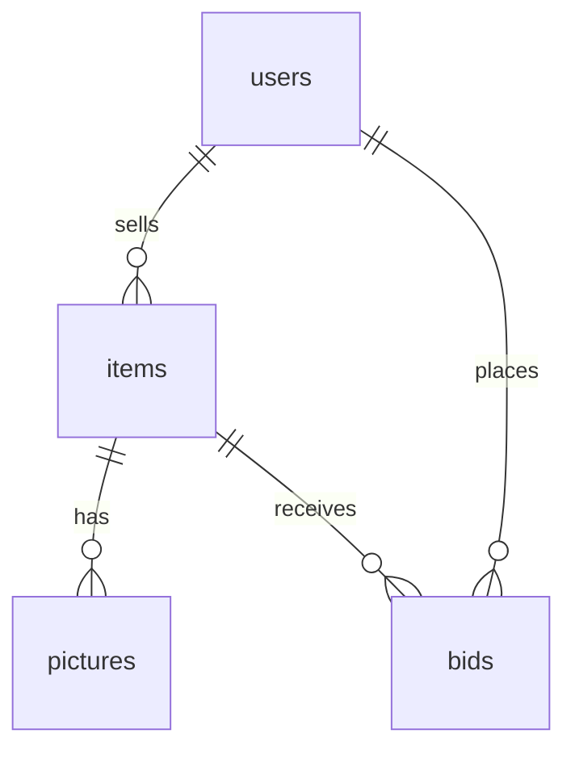

# Database Schema

This document describes the **initial MVP database schema** based on our current ER sketch.  
It is intended to be a **human-readable reference** for the team while building the Go API and Next.js app.

---

## Overview

We store:
- **Users**: accounts for sellers/buyers
- **Items**: auction listings (artworks)
- **Pictures**: images for each item
- **Bids**: bid history for items

---

## Conventions

### IDs
- Use `uuid` for primary keys.

### Timestamps
- Use `timestamptz` (UTC) for time fields.

### Passwords
- **Do not store plaintext passwords.**
- Store only `password_hash` (and optional `password_salt` if needed by the hash scheme).

---

## Relationships (ER)

- `users` 1—N `items` (seller owns many items)
- `items` 1—N `pictures` (an item has multiple images)
- `users` 1—N `bids` (a user can place many bids)
- `items` 1—N `bids` (an item receives many bids)



## Tables

## `users`
**Purpose:** Store buyer/seller accounts.

| column         | type        | nullable | notes |
|---------------|-------------|----------|------|
| id            | uuid        | no       | PK |
| email         | text        | no       | unique |
| password_hash | text        | no       | hashed password (no plaintext) |
| verified      | boolean     | no       | default `false` |
| created_at    | timestamptz | no       | default `now()` |
| updated_at    | timestamptz | no       | default `now()` |

**Constraints**
- `PRIMARY KEY (id)`
- `UNIQUE (email)`

**Indexes**
- `users_email_idx` on `(email)` (unique)

---

## `items`
**Purpose:** Auction listings for artworks.

| column        | type        | nullable | notes |
|--------------|-------------|----------|------|
| id           | uuid        | no       | PK |
| seller_id    | uuid        | no       | FK → `users.id` |
| time_start   | timestamptz | no       | auction start time |
| time_end     | timestamptz | no       | auction end time |
| title        | text        | no       | listing title |
| description  | text        | yes      | seller-provided description |
| author       | text        | yes      | artist/author name (if known) |
| features     | jsonb       | yes      | AI-extracted + user-edited structured attributes |
| year_created | integer     | yes      | year the artwork was created (if known) |
| height     | float        | yes      | height in cm (if known) |
| width      | float     | yes      | width in cm (if known) |
| base_price   | bigint      | no       | starting price in cents |
| increment    | bigint      | no       | minimum bid increment in cents |
| status       | text        | no       | e.g., `draft`, `active`, `ended`, `cancelled` |
| created_at   | timestamptz | no       | default `now()` |
| updated_at   | timestamptz | no       | default `now()` |

**Constraints**
- `PRIMARY KEY (id)`
- `FOREIGN KEY (seller_id) REFERENCES users(id)`
- `time_end > time_start`
- `base_price >= 0`
- `increment > 0`
- `status IN ('draft','active','ended','cancelled')`

**Indexes**
- `items_seller_id_idx` on `(seller_id)`
- `items_status_time_end_idx` on `(status, time_end)` (useful for showing active auctions ending soon)

**Notes on `features`**
Store structured attributes extracted from the artwork image. Example shape:

```json
{
  "medium": "oil",
  "subject": ["landscape"],
  "style": "impressionist-ish",
  "palette": ["#2f3a4c", "#d9c7a6"],
  "orientation": "landscape",
  "mood": ["calm", "warm"],
  "confidence": {
    "medium": 0.84,
    "style": 0.62
  },
  "source": "ai+user_edit"
}
```

---

## `pictures`
**Purpose:** Store images associated with an item (artwork photos, thumbnails, etc.).

| column     | type        | nullable | notes |
|------------|-------------|----------|------|
| id         | uuid        | no       | PK |
| item_id    | uuid        | no       | FK → `items.id` |
| url        | text        | no       | image URL or object storage key |
| created_at | timestamptz | no       | default `now()` |

**Constraints**
- `PRIMARY KEY (id)`
- `FOREIGN KEY (item_id) REFERENCES items(id)`

**Indexes**
- `pictures_item_id_idx` on `(item_id)`

---