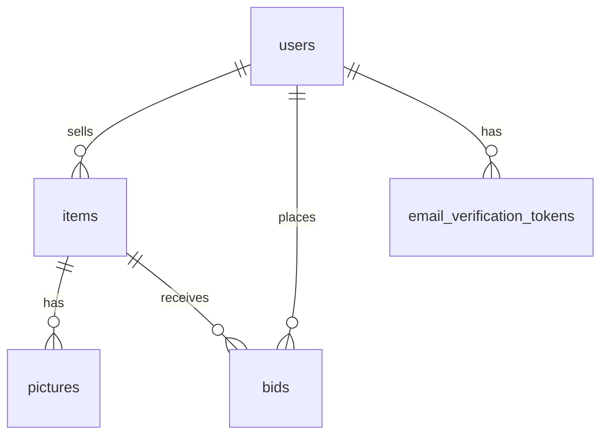

# Database Schema

This document describes the **initial MVP database schema** based on our current ER sketch.  
It is intended to be a **human-readable reference** for the team while building the Go API and Next.js app.

---

## Overview

We store:

- **Users**: accounts for sellers/buyers
- **Items**: auction listings (artworks)
- **Pictures**: images for each item
- **Bids**: bid history for items

---

## Conventions

### IDs

- Use `uuid` for primary keys.

### Timestamps

- Use `timestamptz` (UTC) for time fields.

### Passwords

- **Do not store plaintext passwords.**
- Store only `password_hash` (and optional `password_salt` if needed by the hash scheme).

### Money

All monetary values are stored as **integers representing SGD dollars** (not cents).

Examples:

- `1500` = $1,500.00
- `10500` = $10,500.00

---

## Relationships (ER)

- `users` 1—N `items` (seller owns many items)
- `users` 1—N `email_verification_tokens` (a user can have multiple tokens over time)
- `items` 1—N `pictures` (an item has multiple images)
- `users` 1—N `bids` (a user can place many bids)
- `items` 1—N `bids` (an item receives many bids)



## Tables

## `users`
**Purpose:** Store buyer/seller accounts.

| Column        | Type        | Nullable | Notes                          |
| ------------- | ----------- | -------- | ------------------------------ |
| `id`          | `uuid`      | No       | Primary Key                    |
| `email`       | `text`      | No       | Unique                         |
| `username`    | `text`      | No       | Unique                         |
| `password_hash` | `text`    | No       | Hashed password (no plaintext) |
| `verified`    | `boolean`   | No       | Default `false`                |
| `created_at`  | `timestamptz` | No     | Default `now()`                |
| `updated_at`  | `timestamptz` | No     | Default `now()`                |

**Constraints**

- `PRIMARY KEY (id)`
- `UNIQUE (email)`
- `UNIQUE (username)`

**Indexes**

- `users_email_idx` on `(email)` (unique)
- `users_username_idx` on `(username)` (unique)

---

## `email_verification_tokens`

**Purpose:** Store single-use, expiring tokens used to verify a user’s email address after signup (or after a resend request).

| Column      | Type        | Nullable | Notes                                           |
| ----------- | ----------- | -------- | ----------------------------------------------- |
| `id`        | `uuid`      | No       | Primary Key                                     |
| `user_id`   | `uuid`      | No       | Foreign Key → `users.id`                       |
| `token_hash`| `bytea`     | No       | SHA-256 hash of the raw token (store hash only) |
| `expires_at`| `timestamptz` | No     | Token expiry time                               |
| `used_at`   | `timestamptz` | Yes    | Set when token is consumed (single-use)         |
| `created_at`| `timestamptz` | No     | Default `now()`                                 |

**Constraints**

- `PRIMARY KEY (id)`
- `FOREIGN KEY (user_id) REFERENCES users(id) ON DELETE CASCADE`
- `UNIQUE (token_hash)`

**Indexes**

- `evt_user_id_idx` on `(user_id)`
- `evt_expires_at_idx` on `(expires_at)`

**Notes**

- Raw token should be cryptographically secure random bytes (e.g., 32 bytes) encoded as base64url.
- Store only `token_hash` in DB; raw token is only sent to the user (email link).
- Token is valid only if:
  - `used_at IS NULL`
  - `expires_at > now()`

---

## `items`

**Purpose:** Auction listings for artworks.
| Column              | Type        | Nullable | Notes                                            |
| ------------------- | ----------- | -------- | ------------------------------------------------ |
| `id`                | `uuid`      | No       | Primary Key                                      |
| `seller_id`         | `uuid`      | No       | Foreign Key → `users.id`                        |
| `time_start`        | `timestamptz` | No     | Auction start time                               |
| `time_end`          | `timestamptz` | No     | Auction end time                                 |
| `title`             | `text`      | No       | Listing title                                    |
| `description`       | `text`      | Yes      | Seller-provided description                      |
| `author`            | `text`      | Yes      | Artist/author name (if known)                   |
| `features`          | `jsonb`     | Yes      | AI-extracted + user-edited structured attributes |
| `year_created`      | `integer`   | Yes      | Year the artwork was created (if known)         |
| `height`            | `float`     | Yes      | Height in cm (if known)                         |
| `width`             | `float`     | Yes      | Width in cm (if known)                          |
| `base_price`        | `bigint`    | No       | Starting price in dollars                       |
| `increment`         | `bigint`    | No       | Minimum bid increment in dollars                |
| `status`            | `text`      | No       | E.g., `draft`, `active`, `ended`, `cancelled`   |
| `highest_bid_amount`| `bigint`   | Yes      | Current highest bid in dollars                  |
| `highest_bidder_id` | `uuid`      | Yes      | Foreign Key → `users.id` (current highest bidder) |
| `highest_bid_time`  | `timestamptz` | Yes    | Timestamp of current highest bid                |
| `created_at`        | `timestamptz` | No     | Default `now()`                                 |
| `updated_at`        | `timestamptz` | No     | Default `now()`                                 |

**Constraints**

- `PRIMARY KEY (id)`
- `FOREIGN KEY (highest_bidder_id) REFERENCES users(id)`
- `time_end > time_start`
- `base_price >= 0`
- `increment > 0`
- `status IN ('draft','active','ended','cancelled')`

**Indexes**

- `items_seller_id_idx` on `(seller_id)`
- `items_status_time_end_idx` on `(status, time_end)` (useful for showing active auctions ending soon)
- `items_highest_bid_amount_idx` on `(highest_bid_amount DESC)` (for leaderboard queries)
- `idx_items_draft_time_start` on `items (time_start)` where `status = 'draft'` (useful to update drafts that are scheduled to be active)
- `idx_items_draft_active_time_end` on `items (time_end)` where `status IN ('draft','active')` (useful to update auctions status to end)

**Notes on `features`**
Store structured attributes extracted from the artwork image. Example shape:

```json
{
  "medium": "oil",
  "subject": ["landscape"],
  "style": "impressionist-ish",
  "palette": ["#2f3a4c", "#d9c7a6"],
  "orientation": "landscape",
  "mood": ["calm", "warm"],
  "confidence": {
    "medium": 0.84,
    "style": 0.62
  },
  "source": "ai+user_edit"
}
```

---

## `pictures`

**Purpose:** Store images associated with an item (artwork photos, thumbnails, etc.).
## `pictures`

**Purpose:** Store images associated with an item (artwork photos, thumbnails, etc.).

| Column      | Type        | Nullable | Notes                           |
| ----------- | ----------- | -------- | ------------------------------- |
| `id`        | `uuid`      | No       | Primary Key                     |
| `item_id`   | `uuid`      | No       | Foreign Key → `items.id`        |
| `key`       | `text`      | No       | Image storage key               |
| `created_at`| `timestamptz` | No     | Default `now()`                 |

**Constraints**

- `PRIMARY KEY (id)`
- `FOREIGN KEY (item_id) REFERENCES items(id)`

**Indexes**

- `pictures_item_id_idx` on `(item_id)`

---

## `bids`

**Purpose:** Record bid history for each auction item.
| Column    | Type        | Nullable | Notes                           |
| --------- | ----------- | -------- | ------------------------------- |
| `id`      | `uuid`      | No       | Primary Key, default `gen_random_uuid()` |
| `user_id` | `uuid`      | No       | Foreign Key → `users.id`        |
| `item_id` | `uuid`      | No       | Foreign Key → `items.id`        |
| `price`   | `bigint`    | No       | Bid amount in dollars           |
| `timestamp` | `timestamptz` | No    | Default `now()`                 |

**Constraints**

- `PRIMARY KEY (id)`
- `FOREIGN KEY (user_id) REFERENCES users(id)`
- `FOREIGN KEY (item_id) REFERENCES items(id) ON DELETE CASCADE`
- Recommended checks:
  - `CHECK (price > 0)`

**Indexes**

- `bids_item_id_timestamp_idx` on `(item_id, timestamp DESC)` (fast bid history for item page)
- `bids_user_id_timestamp_idx` on `(user_id, timestamp DESC)` (user activity)
- `bids_item_price_desc_idx` on `(item_id, price DESC)` (fast highest bid lookup)
- `bids_item_price_created_idx` on `(item_id, price, timestamp)` (for validating new bids)

---
